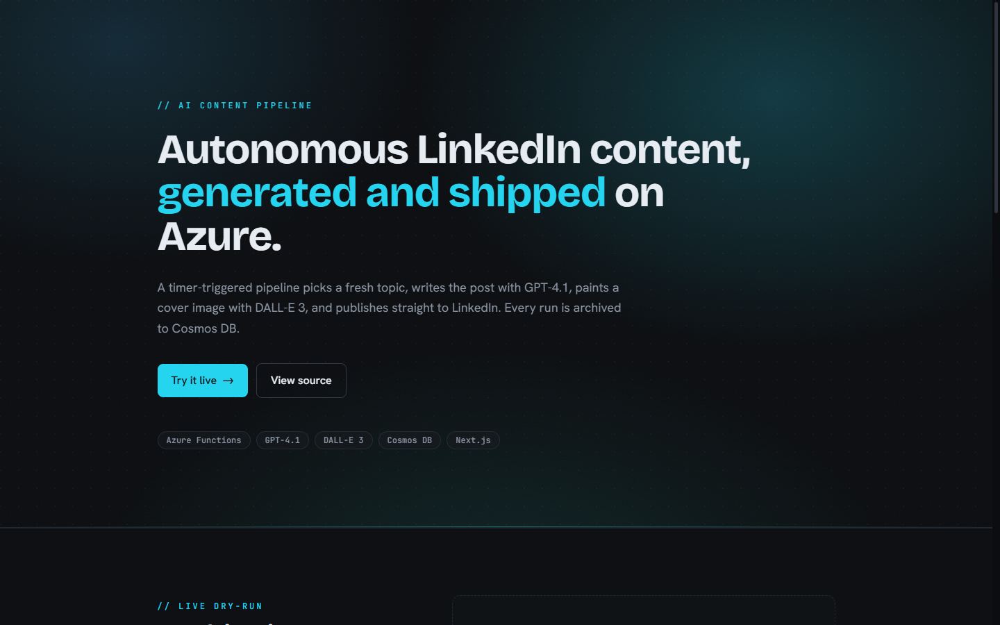
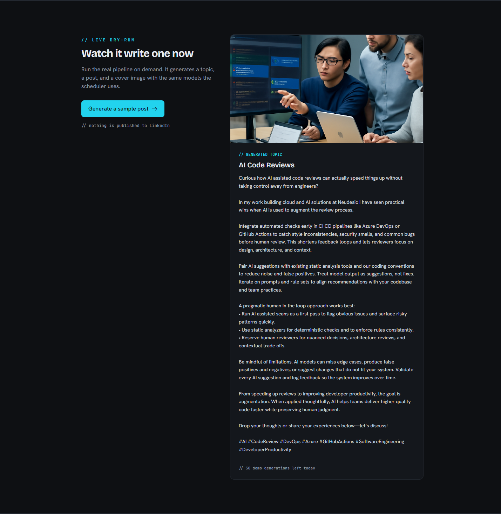
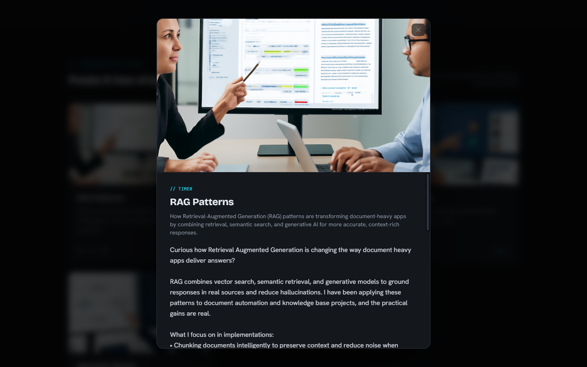
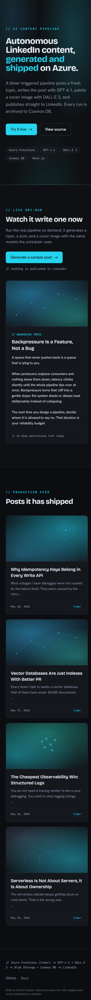
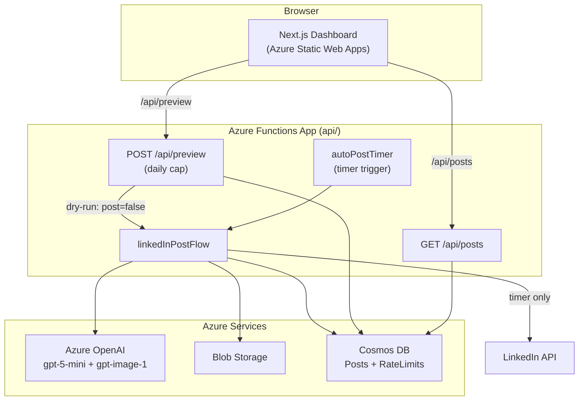

<div align="center">

# LinkedIn AI Auto Poster

### An autonomous Azure pipeline that writes, illustrates, and ships LinkedIn posts on a schedule

[](https://github.com/derekhuynen/linkedin-ai-auto-poster/actions/workflows/main_auto-poster-function.yml)
[](LICENSE)




</div>

A timer-triggered Azure Function picks a fresh topic, drafts the post with gpt-5-mini, generates a cover image with gpt-image-1, publishes to LinkedIn, and archives every run to Cosmos DB. A Next.js dashboard lets anyone browse what it has shipped and watch it generate a sample post live.

## Demo

A read-only gallery of auto-posted content plus a rate-capped "dry-run" that generates a sample post and image on demand but never publishes to LinkedIn. Run it locally with sample data (no Azure needed):

```bash
cd web
npm install
npm run dev   # sample-data mode is on by default
```



Click any card in the gallery to read the full post:



<details>
<summary>More views</summary>



</details>

## Features

- **Scheduled auto-posting.** A timer-triggered Azure Function runs the whole pipeline on a cron schedule.
- **AI topic and post generation.** gpt-5-mini picks a fresh topic (avoiding recent ones) and writes the post.
- **AI cover images.** gpt-image-1 generates a cover image for each post, stored durably in Blob Storage.
- **Live dry-run, safely.** A public endpoint generates a sample post on demand, protected by a global daily cap, and provably never publishes or persists.
- **Read-only gallery API.** A paginated feed of past posts with a server-side projection so no secrets leave the database.
- **Durable archive.** Every run is written to Cosmos DB.

## Architecture

Two deployable apps over a set of Azure services. The Next.js dashboard reaches the API same-origin (`/api/*`) via the Static Web Apps linked backend.



Full data flow and the dry-run safety contract: [docs/architecture.md](docs/architecture.md).

## Repository layout

```
.
├── api/        Azure Functions app (TypeScript): timer + HTTP endpoints
│   ├── src/    flow, functions, services, constants, prompts, types
│   └── tests/  Vitest unit tests
├── web/        Next.js dashboard (static export to Azure Static Web Apps)
│   ├── app/    layout + page
│   ├── components/
│   └── lib/    API client, types, sample data
└── docs/       architecture, deployment, images
```

## Local development

### Backend (`api/`)

```bash
cd api
cp example.settings.json local.settings.json   # then fill in real values
npm install
npm start        # runs the Functions host (func start)
npm test         # Vitest
npm run build    # tsc + copy prompts
```

`local.settings.json` is gitignored. See [docs/deployment.md](docs/deployment.md) for the full list of environment variables.

### Frontend (`web/`)

```bash
cd web
npm install
npm run dev      # http://localhost:3000, sample-data mode on by default
npm test         # Vitest + React Testing Library
npm run build    # static export to web/out
```

To run the dashboard against a real local backend instead of sample data, set `NEXT_PUBLIC_USE_SAMPLE_DATA=false` and `NEXT_PUBLIC_API_BASE=http://localhost:7071`, and start the Functions host with CORS enabled (`func start --cors "*"`).

## Testing

- **Backend:** Vitest unit tests covering the retry helper, the topic type guard, blob content types, the rate limiter, both HTTP handlers, and the pipeline. One test proves the dry-run never calls LinkedIn or Cosmos.
- **Frontend:** the dry-run panel's success, capped, and error states.

Both suites run in CI and gate their respective deploys.

```bash
cd api && npm test    # backend
cd web && npm test    # frontend
```

## Deployment

Both apps deploy from GitHub Actions on push to `main`, with path filters so each deploys independently. Full one-time Azure setup, environment variables, and required secrets are in [docs/deployment.md](docs/deployment.md).

### One-command demo (cost-controlled)

To stand up a throwaway demo environment and tear it down to ~$0 when finished:

```powershell
cp scripts/demo.config.example.json scripts/demo.config.json   # fill in your values
pwsh ./scripts/azure-up.ps1      # provision + deploy + seed, prints the demo URL
pwsh ./scripts/azure-down.ps1    # delete everything
```

The demo uses Consumption/serverless/Free tiers (near-zero idle cost) and runs with the timer and LinkedIn posting disabled, so it never auto-posts. See [scripts/README.md](scripts/README.md).

## License

[MIT](LICENSE) (c) Derek Huynen
