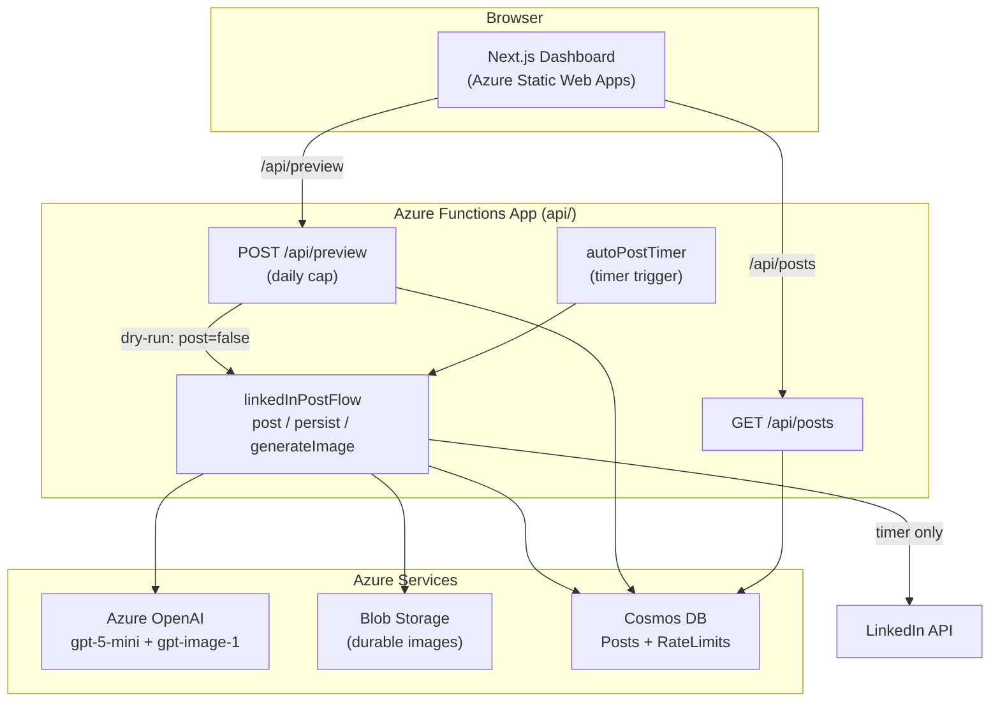

# Architecture

The system is two deployable apps over a set of Azure services:

- **`api/`** an Azure Functions app (TypeScript) that runs the content pipeline on a timer and exposes two HTTP endpoints.
- **`web/`** a Next.js dashboard (static export) deployed to Azure Static Web Apps. It calls the Function App's HTTP API: directly with CORS on the Free SWA tier (the cost-controlled demo default), or same-origin at `/api/*` via a linked backend on the Standard tier.

## Data flow (the pipeline)

`linkedInPostFlow` is the heart of the system. It takes an options object
(`{ triggerBy, post, persist, generateImage }`) so the same code serves both the
scheduled run and the public dry-run:

1. **Pick a fresh topic.** Query the last several posts from Cosmos DB and ask
   gpt-5-mini for a new topic that avoids recent ones. The response is parsed and
   validated against a strict schema.
2. **Write the post and image prompt in parallel.** gpt-5-mini generates the
   LinkedIn post body; a second call generates an image prompt.
3. **Generate and store the image (when enabled).** gpt-image-1 returns the image
   as bytes, which are uploaded to Blob Storage (a durable URL). On the timer
   path, the image is also registered with LinkedIn as a media asset.
4. **Publish (timer path only).** The post and image are published to LinkedIn.
5. **Archive.** The run is written to the Cosmos DB posts container.

## The dry-run contract

The public `POST /api/preview` endpoint calls `linkedInPostFlow` with
`post: false` and `persist: false`. Those flags gate every LinkedIn-facing call
(`uploadImageToLinkedIn`, `postToLinkedIn`) and the Cosmos write, so a preview
generates a real topic, post, and image but **never publishes to LinkedIn and
never writes to the gallery**. This property is covered by unit tests in
`api/tests/linkedInPostFlow.test.ts`.

## The daily cap

Because the preview spends real OpenAI budget on every click, it is protected by
a global daily cap. `RateLimitService` keeps one counter document per UTC day in
a dedicated Cosmos container (`RateLimits`, partition key `/id`) and increments
it with ETag optimistic concurrency, so concurrent callers cannot overspend.
When the cap is reached the endpoint returns `429` with a `resetsAt` timestamp
and generates nothing.

## Endpoints

| Method + route      | Purpose                                                        | Auth      |
| ------------------- | ------------------------------------------------------------- | --------- |
| `GET /api/posts`    | Paginated public gallery; server-side projection (no secrets) | anonymous |
| `POST /api/preview` | Rate-capped live dry-run; never posts or persists             | anonymous |

The gallery query projects only public-safe fields
(`topic`, `topicDescription`, `linkedInPost`, `blobStorageUrl`, `createdAt`,
`triggerBy`) in Cosmos itself, so internal fields (the LinkedIn asset URN, the
LinkedIn asset URN, raw research) never leave the database.
