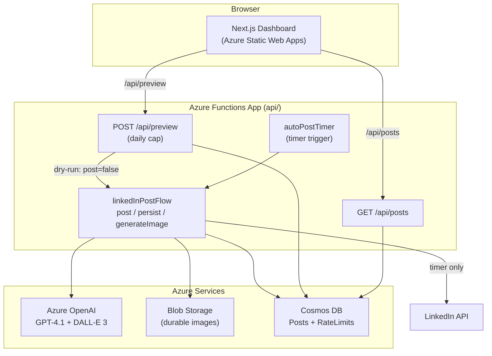

# Phase 4: Docs, Diagram, and Packaging Implementation Plan

> **For agentic workers:** This phase is documentation and packaging. Produce the exact content specified; verify links and that the apps still build/test. Steps use checkbox (`- [ ]`) syntax.

**Goal:** Make the GitHub repo read as a polished, accurate, recruiter-ready project: a rewritten root README with badges, a live-demo link, an embedded architecture diagram and screenshots; a `docs/architecture.md` and `docs/deployment.md`; a real LICENSE; and packaging cleanup (placeholders, stray comments, README↔repo drift).

**Architecture:** Pure docs/packaging. No application code changes. The README consolidates the old `ReadMe.md`, fixes references to files that never existed, and points to the Phase 3 dashboard and the Phase 1-2 backend.

**Tech Stack:** Markdown, Mermaid (renders natively on GitHub).

This is the fourth and final plan from `docs/superpowers/specs/2026-05-29-showcase-upgrade-design.md`. It depends on Phases 1-3 (all merged): `api/` backend, `web/` dashboard, and the screenshots already captured in `docs/images/`.

---

## Known cleanup targets (surveyed)

- No `LICENSE` file (package.json declares MIT).
- `api/package.json`: `repository.url`/`bugs.url`/`homepage` use `your-username`; `contributors[0].email` is `derek@example.com`.
- `api/src/prompts/generate_linkedin_image_prompt.md:1`: stray `<!-- filepath: d:\... -->` VS Code comment.
- Root `ReadMe.md`: references nonexistent docs (`ENVIRONMENT_VARIABLES.md`, `IMAGE_GENERATION_GUIDE.md`, `DALLE3_TESTING.md`, `CUSTOMIZE_DALLE3_IMAGES.md`, `SAMPLE_IMAGE_PROMPTS.md`), a nonexistent `scripts/` dir with `deploy-infra.sh` / `test_dalle3.ps1` / `publishProfile.publishsettings`, and a `local.settings.json` quick-start. It also lists "Web dashboard" as future roadmap (now built).

## File structure for this phase

- **Create:** `LICENSE`, `docs/architecture.md`, `docs/deployment.md`, `README.md` (replacing `ReadMe.md`).
- **Delete:** `ReadMe.md` (content folded into `README.md`).
- **Modify:** `api/package.json`, `api/src/prompts/generate_linkedin_image_prompt.md`.

Work on branch `feat/phase4-docs`. Real repo URL (from `git remote`): `https://github.com/derekhuynen/LinkedIn_AI_Auto_Poster`.

---

### Task 1: Packaging cleanup

**Files:** create `LICENSE`; modify `api/package.json`, `api/src/prompts/generate_linkedin_image_prompt.md`.

- [ ] **Step 1: Add an MIT LICENSE**

Create `LICENSE` (root) with the standard MIT text, copyright line:
```
MIT License

Copyright (c) 2026 Derek Huynen

Permission is hereby granted, free of charge, to any person obtaining a copy
...
```
(Use the full, verbatim MIT license body. Year 2026, holder "Derek Huynen".)

- [ ] **Step 2: Fix package.json placeholders**

In `api/package.json`, replace the three `your-username` URLs with the real repo and the placeholder email:
- `repository.url` -> `https://github.com/derekhuynen/LinkedIn_AI_Auto_Poster.git`
- `bugs.url` -> `https://github.com/derekhuynen/LinkedIn_AI_Auto_Poster/issues`
- `homepage` -> `https://github.com/derekhuynen/LinkedIn_AI_Auto_Poster#readme`
- `contributors[0].email` -> remove the line (or set to a real address). Default: remove the `email` field to avoid a fake address; keep `name` and `url`.

- [ ] **Step 3: Remove the stray filepath comment**

In `api/src/prompts/generate_linkedin_image_prompt.md`, delete line 1 (`<!-- filepath: d:\... -->`) and any leading blank line it leaves.

- [ ] **Step 4: Verify the backend still builds (package.json is still valid JSON)**

Run:
```bash
cd api && node -e "JSON.parse(require('fs').readFileSync('package.json','utf8')); console.log('valid')" && npm run build >/dev/null 2>&1 && echo "build OK"
```
Expected: `valid` then `build OK`.

- [ ] **Step 5: Commit**

```bash
git add LICENSE api/package.json api/src/prompts/generate_linkedin_image_prompt.md
git commit -m "chore: add MIT LICENSE, fix package metadata, drop stray comment"
```

---

### Task 2: Architecture document

**Files:** create `docs/architecture.md`.

- [ ] **Step 1: Write `docs/architecture.md`** with a Mermaid flowchart and a data-flow walkthrough. The diagram must show: the timer trigger and the two HTTP endpoints into the Function App; the Function App calling Azure OpenAI (GPT-4.1 for topic+post, DALL-E 3 for image), Blob Storage (durable image), Cosmos DB (posts + rate-limit counter), and the LinkedIn API; and the Next.js dashboard (Static Web Apps) calling `/api/posts` and `/api/preview` through the same-origin linked backend. Use this Mermaid source (renders on GitHub):

````markdown

````

Beneath the diagram, write a concise numbered data-flow walkthrough (topic -> post + image in parallel -> image to Blob -> publish to LinkedIn on the timer path -> archive to Cosmos), and a short note on the dry-run contract (preview sets `post:false, persist:false`, so it never publishes or persists) and the daily cap.

- [ ] **Step 2: Commit** `docs: add architecture diagram and data flow`.

---

### Task 3: Deployment document

**Files:** create `docs/deployment.md`.

- [ ] **Step 1: Write `docs/deployment.md`** consolidating the owner checklists from all phases into one runnable guide. Sections:
  - **Azure resources:** Function App (Node 20), Azure OpenAI deployments (gpt-4.1 West, dall-e-3 East), Blob Storage container `linkedin-images`, Cosmos DB database `AutoPoster` with containers `LinkedInPosts` (posts) and `RateLimits` (partition key `/id`), and a Static Web App with the Function App linked as the backend ("Bring your own backend").
  - **Function App env vars:** the full list from `api/example.settings.json` plus the Phase 2 additions `COSMOS_RATELIMIT_CONTAINER` and `DRYRUN_DAILY_CAP`. Present as a table (name, example, purpose).
  - **GitHub secrets:** the existing Azure deploy secrets for the API workflow, and `AZURE_STATIC_WEB_APPS_API_TOKEN` for the web workflow.
  - **CI/CD:** `main_auto-poster-function.yml` deploys `api/` on `api/**` changes (gated on typecheck+tests+build); `web-deploy.yml` deploys `web/` on `web/**` changes (gated on tests+build).
  - **Post-deploy:** copy the Static Web App URL into the README live-demo link; verify `/api/posts` returns and the dry-run respects the cap.

- [ ] **Step 2: Commit** `docs: add deployment guide`.

---

### Task 4: README rewrite

**Files:** delete `ReadMe.md`; create `README.md`.

- [ ] **Step 1: Remove the old readme**

Run:
```bash
git rm ReadMe.md
```
(On case-insensitive Windows this frees the path so a new `README.md` can be created cleanly.)

- [ ] **Step 2: Write `README.md`** with this structure, all content accurate to the actual repo:
  - **Title + one-line pitch.**
  - **Badge row:** CI status (the API workflow), license (MIT), and a tech-stack line. Use shields.io static badges where a live status isn't wired.
  - **Live demo link:** a prominent line with a clearly-marked placeholder `<!-- TODO: paste Static Web App URL -->` plus the local way to see it (`cd web && npm run dev`, sample mode on by default).
  - **Screenshots:** embed `docs/images/dashboard-hero.png` and `docs/images/dashboard-dryrun.png` (and optionally `dashboard-mobile.png`).
  - **Architecture:** embed the Mermaid diagram (or link to `docs/architecture.md`) and the Azure services list.
  - **Features:** AI topic+post generation (GPT-4.1), DALL-E 3 images, scheduled auto-posting, the read-only gallery API, the rate-capped live dry-run, Cosmos archival.
  - **Repo layout:** the real two-app structure (`api/`, `web/`, `docs/`).
  - **Local development:** accurate steps for both apps. `api/`: copy `example.settings.json` to `local.settings.json`, `npm install`, `npm start`, `npm test`. `web/`: `npm install`, `npm run dev` (sample mode), `npm test`, `npm run build`.
  - **Testing:** note 22 backend tests (Vitest, incl. the dry-run-never-posts guarantee) + 3 web tests, gated in CI.
  - **Deployment:** link to `docs/deployment.md`.
  - **License:** MIT, link to `LICENSE`.
  - Remove ALL references to files that do not exist (the five nonexistent guide docs, the `scripts/` dir, `test_dalle3.ps1`). Every command and path must resolve in the real repo. No em-dashes.

- [ ] **Step 3: Commit** `docs: rewrite README with diagram, screenshots, and accurate setup`.

---

### Task 5: Final verification

- [ ] **Step 1: No dead internal links.** Grep the README and docs for linked paths and confirm each referenced file exists:
```bash
cd "$(git rev-parse --show-toplevel)"
node -e "const fs=require('fs');for(const f of ['LICENSE','docs/architecture.md','docs/deployment.md','docs/images/dashboard-hero.png','docs/images/dashboard-dryrun.png']){console.log(fs.existsSync(f)?'ok '+f:'MISSING '+f);}"
```
Expected: all `ok`.

- [ ] **Step 2: No surviving drift references.** Confirm the removed names no longer appear in tracked docs:
```bash
git grep -n "ENVIRONMENT_VARIABLES.md\|IMAGE_GENERATION_GUIDE.md\|DALLE3_TESTING.md\|test_dalle3.ps1\|your-username\|derek@example.com\|filepath:" -- ':!docs/superpowers/' || echo "no drift references remain"
```
Expected: `no drift references remain`.

- [ ] **Step 3: Apps still green** (packaging change sanity):
```bash
cd api && npm test >/dev/null 2>&1 && echo "api tests ok"
cd ../web && npm run build >/dev/null 2>&1 && echo "web build ok"
```
Expected: both ok.

- [ ] **Step 4: Working tree clean** (`git status`).

---

## Self-review notes

- **Spec coverage:** README rewrite (badges, live-demo link, embedded diagram, screenshots, accurate Features/Local Dev/Deployment/Testing), `docs/architecture.md` (Mermaid + data flow), `docs/deployment.md` (consolidated owner checklist), LICENSE (MIT), and packaging cleanup (placeholders, stray comment) -- all from the spec's "Docs and presentation" section plus the deferred package.json fixes.
- **Drift eliminated:** Task 5 step 2 asserts none of the originally-referenced nonexistent files survive in tracked docs.
- **Honesty:** the live-demo URL is a clearly-marked placeholder for the owner to fill after the first SWA deploy; screenshots are the real captured app.
- **No placeholders in the plan itself:** the only intentional placeholder is the live-demo URL in the README, explicitly marked for owner completion.
```
